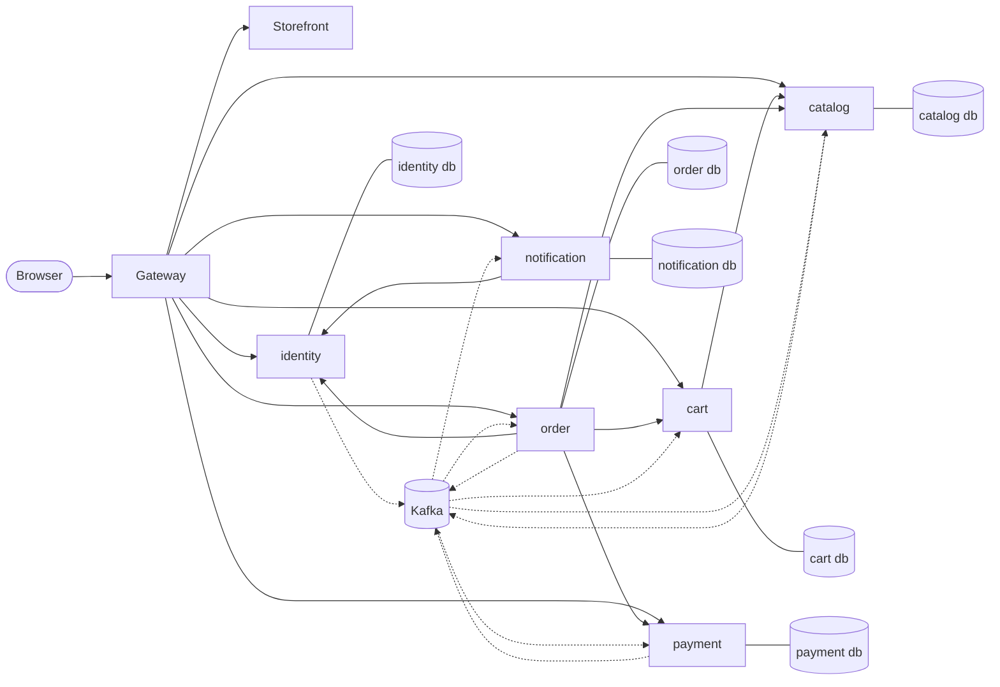
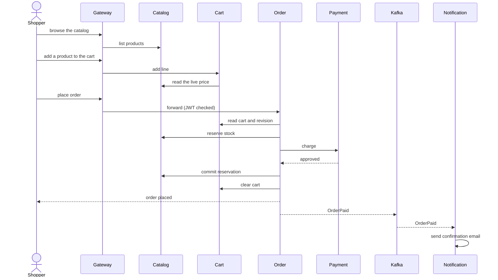

# Scalable E-Commerce Platform (Kotlin)

An online shop built as independently deployable Kotlin microservices behind one gateway, talking over HTTP and Kafka
events, with a TypeScript and React storefront. One command runs the whole platform on your machine.

[](https://github.com/raphaelpanta/scalable-e-commerce-platform-kotlin/actions/workflows/verify.yml)
[](LICENSE)


## Contents

- [Overview](#overview)
- [Quick start](#quick-start)
- [Architecture](#architecture)
- [Repository layout](#repository-layout)
- [Build and test](#build-and-test)
- [Documentation](#documentation)
- [Contributing](#contributing)
- [License](#license)

## Overview

Six bounded-context services on Spring Boot WebFlux and coroutines, each with its own PostgreSQL database and
hexagonal layering, sit behind a Kotlin gateway that also serves the storefront. It is built spec-first with
[Spec Kit](https://github.com/github/spec-kit): the rules live in the [constitution](.specify/memory/constitution.md)
and every feature has a spec, plan and task list under [`specs/`](specs/).

## Quick start

### Prerequisites

| Tool | Version | Why |
|---|---|---|
| JDK | 25 | builds and tests the services |
| Docker or Podman, with Compose v2 | about 10 GiB of memory for the engine | runs the platform (21 containers) |
| Node and npm | 24 | builds and tests the storefront |
| `gitleaks` | any recent | secret-scanning pre-commit hook |
| `curl`, `jq`, `openssl`, `git` | any recent | health checks, key generation, the clone |

No need to check by hand: `scripts/dev-env.sh init` checks each one and, when one is missing, prints the exact fix and
exits with code 3 without changing anything (`--install` installs the missing tools for you).

### Start

```bash
git clone https://github.com/raphaelpanta/scalable-e-commerce-platform-kotlin.git   # creates the project directory
```

```bash
cd scalable-e-commerce-platform-kotlin   # you are now at the repository root
```

```bash
scripts/dev-env.sh init --start
```

The last command checks the machine, writes `platform/compose/.env` with fresh secrets, enables the git hooks, builds
and starts the platform, waits until it is healthy and prints the addresses below. The first build takes a few minutes.

> [!WARNING]
> Give the container engine itself about **10 GiB** of memory (the Docker Desktop VM or the Podman machine, for
> example `podman machine set --cpus 6 --memory 10240`). An 8 GiB engine runs out of memory.

> [!NOTE]
> On Podman, images need `BUILDAH_FORMAT=docker` or no service reports healthy; the script sets it
> ([details](docs/running-locally.md)).

### What you get

| Address | What |
|---|---|
| http://localhost:8080 | the storefront and the `/api/v1` API, through the gateway (the only public entry point) |
| http://localhost:3000 | Grafana: dashboards, traces and logs |
| http://localhost:8025 | Mailpit: the test mailbox that receives every email the platform sends |

### Status and stop

```bash
scripts/dev-env.sh status   # each component's state, the addresses, engine memory, CPUs and disk
scripts/dev-env.sh down     # stop everything and keep the data (add --volumes to delete it)
```

`update` rebuilds after a pull, `reset` starts over with empty databases: [all commands](docs/dev-environment.md).

<details>
<summary>Manual start (without the script)</summary>

In `platform/compose`: copy `.env.example` to `.env`, generate `IDENTITY_SIGNING_KEY` and `BROWSER_SESSION_KEY`, run
`docker compose -p ecommerce-platform --profile core --profile observability up -d --build` and wait until
`docker compose -p ecommerce-platform ps` shows every service healthy. The exact commands and the memory limits are in
[docs/running-locally.md](docs/running-locally.md).

</details>

## Architecture



Solid arrows are HTTP calls, dotted arrows Kafka events. Services share no database and no domain code; each is split
into `domain`, `application` and `infrastructure` modules, so dependencies point inward only
([full map](docs/architecture.md)).

| Service | Responsibility | Build |
|---|---|---|
| identity | accounts, sign-in, roles, addresses; issues the JWTs | [](https://github.com/raphaelpanta/scalable-e-commerce-platform-kotlin/actions/workflows/identity.yml) |
| catalog | categories, products, stock levels and reservations | [](https://github.com/raphaelpanta/scalable-e-commerce-platform-kotlin/actions/workflows/catalog.yml) |
| cart | anonymous and account carts, priced live from the catalog | [](https://github.com/raphaelpanta/scalable-e-commerce-platform-kotlin/actions/workflows/cart.yml) |
| order | checkout orchestration, order and payment status, cancellation | [](https://github.com/raphaelpanta/scalable-e-commerce-platform-kotlin/actions/workflows/order.yml) |
| payment | charges and refunds through a simulated provider | [](https://github.com/raphaelpanta/scalable-e-commerce-platform-kotlin/actions/workflows/payment.yml) |
| notification | email and SMS on account, order and payment events | [](https://github.com/raphaelpanta/scalable-e-commerce-platform-kotlin/actions/workflows/notification.yml) |
| gateway | single entry point: JWT checks, routing, rate limits, browser sessions | [](https://github.com/raphaelpanta/scalable-e-commerce-platform-kotlin/actions/workflows/gateway.yml) |
| storefront | the web shop (TypeScript and React), served as static files | [](https://github.com/raphaelpanta/scalable-e-commerce-platform-kotlin/actions/workflows/storefront.yml) |

<details>
<summary>Purchase flow</summary>

The order service orchestrates checkout one hop at a time; the outcome then travels as events
([ADR 0002](docs/adr/0002-synchronous-stock-reservation.md), [ADR 0003](docs/adr/0003-cart-revision-checkout.md)).



A declined charge releases the reservation and keeps the cart
([every alternative](docs/architecture.md#checkout-journey)).

</details>

## Repository layout

```text
services/      one directory per bounded context (domain, application, infrastructure) and the gateway
libs/          shared platform libraries (security, messaging, test fixtures), no domain code
frontend/      the storefront: TypeScript, React, Vite
contracts/     OpenAPI and AsyncAPI contracts, the source of truth for every API and event
acceptance/    cross-service Cucumber acceptance scenarios
platform/      Compose stack, Dockerfiles, observability, performance tests, CI runner
build-logic/   Gradle convention plugins
gradle/        version catalog (libs.versions.toml), the only place versions live
scripts/       dev environment, repository bootstrap, lint and their offline tests
docs/          guides and architecture decision records
specs/         one specification, plan and task list per feature
```

## Build and test

```bash
./gradlew -q verify
```

The whole gate, silent on success: toolchain and version checks, ktlint, detekt, every test layer, architecture rules,
Pitest mutation testing, the storefront and the repository scripts ([build guide](docs/build.md),
[CI/CD pipelines](docs/ci-cd.md)).

```bash
./gradlew -q :services:catalog:domain:test                       # unit tests of one module
./gradlew -q :services:catalog:infrastructure:integrationTest    # one layer: also contractTest, acceptanceTest
./gradlew -q contractTest contractVerify                         # Pact consumers, then provider verification
./gradlew newService -Pname=<context>                            # scaffold a new service
scripts/tests/run-all.sh                                         # offline tests of the repository scripts
scripts/lint.sh                                                  # shellcheck over the repository scripts
```

> [!TIP]
> Integration, contract and acceptance tests start their databases and brokers with Testcontainers, so the container
> engine must be running.

## Documentation

| Document | Read it when |
|---|---|
| [docs/build.md](docs/build.md) | you build, test or add a module or dependency |
| [docs/dev-environment.md](docs/dev-environment.md) | you need a `scripts/dev-env.sh` command or flag |
| [docs/running-locally.md](docs/running-locally.md) | you run the stack by hand or troubleshoot it |
| [docs/architecture.md](docs/architecture.md) | you want the full system map, edges and events |
| [docs/ci-cd.md](docs/ci-cd.md) | you work on the GitHub Actions pipelines |
| [docs/storefront.md](docs/storefront.md) | you work on the web shop |
| [docs/gateway.md](docs/gateway.md) | you change routes, sessions or rate limits |
| [contracts/README.md](contracts/README.md) | you change an API or an event |
| [CONTRIBUTING.md](CONTRIBUTING.md) | you open a pull request |
| [SECURITY.md](SECURITY.md) | you found a vulnerability |

## Contributing

Read [CONTRIBUTING.md](CONTRIBUTING.md) first. In short: run `scripts/dev-env.sh init` (it enables the secret-scanning
hook, which needs [gitleaks](https://github.com/gitleaks/gitleaks)), work on a branch, open a pull request and complete
the checklist in the template. `main` is protected and pull requests are squash-merged. Please follow the
[code of conduct](CODE_OF_CONDUCT.md) and report vulnerabilities privately as described in [SECURITY.md](SECURITY.md).

<details>
<summary>How this repository was published</summary>

The repository was created and hardened with an idempotent script, repeatable for future repositories:

```bash
scripts/bootstrap-repo.sh --dry-run        # read-only rehearsal: prints every step, changes nothing
scripts/bootstrap-repo.sh                  # publish (asks you to type the repository name to confirm)
scripts/verify-repo.sh                     # check the result from the outside
```

It requires `git`, an authenticated [GitHub CLI](https://cli.github.com/) (`gh auth login`) and `gitleaks` (installed
with Homebrew when missing). Flags: `--owner`, `--name`, `--require-check <context>`, `--admin-bypass`, `--yes`,
`--verbose`. The procedure and its safeguards are specified in `specs/003-github-public-repo/`.

</details>

## License

Released under the [MIT License](LICENSE).
