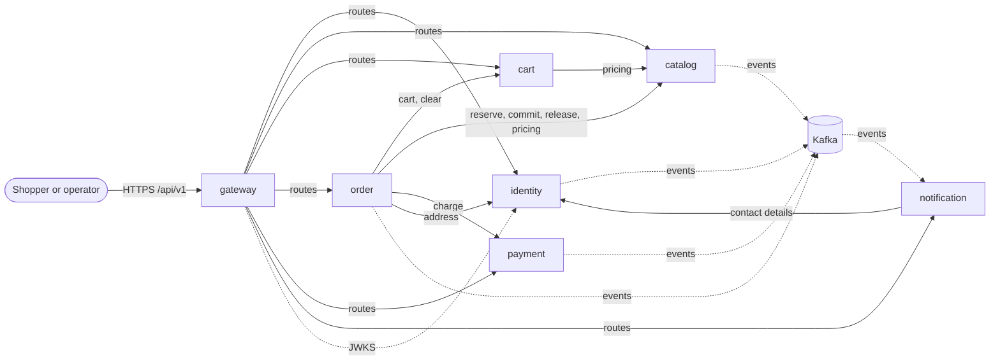
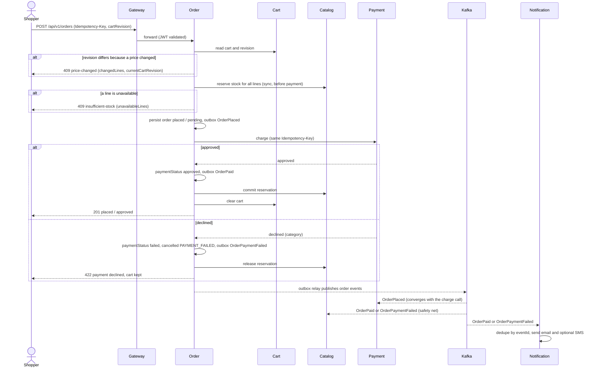

# Architecture

Architecture of the platform delivered by feature 004
([spec](../specs/004-ecommerce-platform-mvp/spec.md), [plan](../specs/004-ecommerce-platform-mvp/plan.md)): six
bounded-context services behind a Kotlin gateway, talking over versioned HTTP and Kafka events. This page is the
map; the rules it summarises live in the [constitution](../.specify/memory/constitution.md), the
[service conventions](service-conventions.md) (binding implementation details, they win on conflict) and the
[contracts](../contracts/README.md) (source of truth for every API and event). Decisions with alternatives are
recorded as [ADRs](adr/README.md).

## 1. Bounded contexts

One bounded context is one deployable service with its own PostgreSQL database; contexts share no database and no
domain code (Principle VI). Cross-context references hold ids only.

| Context | Owns | Publishes | Consumes | Notes |
|---|---|---|---|---|
| `identity` | accounts, credentials, roles, addresses, sessions, notification preferences, JWT signing keys | `AccountRegistered`, `AccountVerified`, `AccountDeleted`, `PasswordResetRequested` | none | Issues JWTs and serves the JWKS; anonymises on deletion (FR-007) |
| `catalog` | categories, products, inventory levels, stock reservations, stock adjustments, audit | `StockReserved`, `StockCommitted`, `StockReservationReleased` | `OrderPaid`, `OrderPaymentFailed`, `OrderCancelled` | Conditional updates keep stock non-negative ([ADR 0002](adr/0002-synchronous-stock-reservation.md)) |
| `cart` | anonymous and account carts, cart revision | `CartMerged` | `AccountDeleted`, `OrderPaid` | Prices read live from catalog; revision drives [ADR 0003](adr/0003-cart-revision-checkout.md) |
| `order` | orders, order and payment status, idempotency records, cancellation | `OrderPlaced`, `OrderPaid`, `OrderPaymentFailed`, `OrderPreparing`, `OrderShipped`, `OrderDelivered`, `OrderCancelled` | `PaymentApproved`, `PaymentDeclined`, `PaymentPending`, `RefundRecorded`, `AccountDeleted` | Orchestrates checkout; two-status model ([ADR 0001](adr/0001-two-status-order-model.md)) |
| `payment` | charge and refund attempts, simulated provider behind `PaymentProviderPort` | `PaymentApproved`, `PaymentDeclined`, `PaymentPending`, `RefundRecorded` | `OrderPlaced`, `OrderCancelled` | One approved charge per order; no card data stored |
| `notification` | recipients (read model), notifications, delivery attempts | `NotificationSent`, `NotificationFailed` | account, order and payment events | Email (Mailpit locally) and SMS simulator; order flow never depends on delivery |
| `gateway` | nothing (no database) | none | none | Single public entry point: JWT, route table, rate limits, correlation id |

Event payloads and consumers: [`contracts/asyncapi/events.yaml`](../contracts/asyncapi/events.yaml); full model:
[data-model.md](../specs/004-ecommerce-platform-mvp/data-model.md) section 3.

Solid arrows are synchronous HTTP calls (each service, including the gateway, also validates JWTs against the
identity JWKS and never calls identity per request); dotted arrows are Kafka traffic. Every service also has an
outbox and, where it consumes, a processed-event table in its own database. Synchronous chains stay one hop deep
(Principle VI): the order service fans out to its providers, which never call further services.

## 2. Hexagonal layering per service

Each context is three Gradle modules, so the dependency rule `domain <- application <- infrastructure` is enforced by
the module graph, not by convention ([plan](../specs/004-ecommerce-platform-mvp/plan.md) "Structure Decision",
[build guide](build.md)).

| Module | Convention plugin | Contains | Must not contain |
|---|---|---|---|
| `:services:<ctx>:domain` | `kotlin-domain` | Aggregates, entities, value objects for every invariant, domain events, state machines, domain services; pure functions returning `Either`-style results | Any framework, persistence, HTTP or messaging type; any project dependency |
| `:services:<ctx>:application` | `kotlin-application` | Use cases, ports (Kotlin interfaces) for repositories, clock, provider and remote services, authorisation decisions (deny by default), orchestration | Spring, adapters, `infrastructure` imports |
| `:services:<ctx>:infrastructure` | `kotlin-service` | Spring Boot WebFlux app: controllers, JWT resource server, R2DBC repositories, Kafka consumers, outbox relay, schedulers (expiry, purge), internal HTTP clients, Flyway migrations, `application.yml`, tests of all four layers | Business rules |
| `:services:gateway` | `kotlin-boot-app` | Routes, JWT validation, rate limiting, correlation filter, security headers | Domain logic (it has no domain) |

Rules and guards:

- **Konsist rule** (`config/architecture`, run in every service's `test` layer): `domain` sources must not import
  `org.springframework`, `io.r2dbc`, `jakarta`, `org.flywaydb` or the service's `application` and `infrastructure`
  packages; `application` sources must not import `infrastructure` or `org.springframework`. The module graph is the
  first guard, Konsist the second; both fail the build.
- Value objects for ids, money, quantities, statuses and so on are validated at construction; primitives do not cross
  a domain boundary (Principle II). Each service keeps its own copy of the value objects it needs.
- Expected failures are values (`Either`), exceptions are translated at adapters into RFC 9457 problems
  (Principle IV). I/O is `suspend`/`Flow`; no `runBlocking` or `GlobalScope` in production code.
- Test layers per `infrastructure` module: `test` (unit, property, Konsist), `integrationTest` (Testcontainers),
  `contractTest` (Pact consumer, plus `contractVerify` for providers), `acceptanceTest` (Cucumber against the service
  alone); domain and application have unit tests and Pitest at 80 %. Cross-service Cucumber journeys live in
  `:acceptance` and run against a Compose stack.

### Shared libraries

| Library | Packages | May contain (Principle VI) | Must not contain |
|---|---|---|---|
| `:libs:platform-core` | `problem`, `correlation`, `values`, `security`, `observability`, `http`, `testing` | RFC 9457 `Problem`, correlation-id filter, validated generic value objects, resource-server and token plumbing, logging and tracing setup, WebClient defaults, test fixtures (`Images`, ...) | Business rules, entities, anything specific to one context |
| `:libs:platform-messaging` | `messaging.envelope`, `messaging.outbox`, `messaging.consumer` | Event envelope, `OutboxPublisher` and relay, `IdempotentConsumer`, the `db/messaging/V1_1__messaging.sql` migration (`outbox`, `processed_event`) | Event payload types of a context, handlers, business rules |

Both are small, versioned with the monorepo and used by `infrastructure` modules and the gateway; `domain` and
`application` modules have no project dependency except their sibling.

## 3. Synchronous edges

**Public.** Every public path is `/api/v1/<context>/...`, matches an OpenAPI file in
[`contracts/openapi/`](../contracts/openapi) and is routed by the gateway per
[gateway-routes.md](../specs/004-ecommerce-platform-mvp/contracts/gateway-routes.md): unknown method/path pairs
answer 404 and nothing is forwarded; `/actuator/**` and `/internal/**` are never routed.

**Internal.** `/internal/**` endpoints are service-to-service only, never routed by the gateway, and require
`X-Internal-Token` (`INTERNAL_API_TOKEN`, no committed default) plus a propagated `X-Correlation-Id`. Contracts:
[`contracts/internal/`](../contracts/internal).

| Caller | Provider | Endpoints | Purpose |
|---|---|---|---|
| gateway, every service | identity | `GET /.well-known/jwks.json` (no token) | Validate access tokens locally |
| order | cart | `GET /internal/carts/by-account/{accountId}`, `POST .../clear` | Read cart and revision, clear after approval |
| order | catalog | `POST /internal/reservations`, `.../{id}/commit`, `.../{id}/release`, `GET /internal/products/pricing` | Reserve, commit, release; freeze prices |
| order | payment | `POST /internal/charges` | Charge (`Idempotency-Key` mandatory); refunds follow `OrderCancelled` in payment |
| order | identity | `GET /internal/accounts/{accountId}/addresses/{addressId}` | Delivery address snapshot |
| notification | identity | `GET /internal/accounts/{accountId}/contact` | Contact details and preferences |
| cart | catalog | `GET /internal/products/{productId}/pricing`, `/internal/products/pricing` | Live price and availability |

**Pact matrix.** Each edge above has a consumer-driven Pact owned by the consumer and verified by the provider in its
own build; a breaking change fails the provider's pipeline. Exact interaction names, provider states and examples:
[`contracts/internal/pact-interactions.md`](../contracts/internal/pact-interactions.md); matrix:
[pact-matrix.md](../specs/004-ecommerce-platform-mvp/contracts/pact-matrix.md).

| Consumer | Provider | Kind |
|---|---|---|
| gateway | identity | HTTP (JWKS: valid, rotation, unavailable) |
| order | cart, catalog, payment, identity | HTTP |
| notification | identity | HTTP |
| cart | catalog | HTTP |
| notification | identity, order, payment | Message |
| order | payment, identity | Message |
| catalog | order | Message |

Services read validated claims; they never call identity per request. Health and metrics are on the management port
8081 and are not part of any Pact.

## 4. Asynchronous edges

Topics are `<context>.<aggregate>.v1`, keyed by `aggregateId`, JSON envelope (`eventId`, `type`, `version`,
`occurredAt`, `aggregateId`, `correlationId`, `producer`, `payload`).

| Topic | Producer | Consumers (group id = context name) |
|---|---|---|
| `identity.account.v1` | identity | notification, cart (`AccountDeleted`), order (`AccountDeleted`) |
| `catalog.stock.v1` | catalog | none required in the MVP (audit); the AsyncAPI file also lists `order` as a consumer, the data model does not |
| `cart.cart.v1` | cart | none (audit) |
| `order.order.v1` | order | payment (`OrderPlaced`, `OrderCancelled`), catalog (`OrderPaid`, `OrderPaymentFailed`, `OrderCancelled`), notification (paid, failed, shipped, delivered, cancelled), cart (`OrderPaid`) |
| `payment.payment.v1` | payment | order, notification (`RefundRecorded`) |
| `notification.notification.v1` | notification | none (operator observability) |

Delivery guarantees (binding, from [events.yaml](../contracts/asyncapi/events.yaml)):

- **Outbox.** A producer writes the event to its `outbox` table in the same transaction as the state change through
  `OutboxPublisher`; a relay publishes rows to Kafka. No dual write. Published rows are purged after 7 days.
- **Idempotent consumers.** Handlers run inside `IdempotentConsumer`, which dedupes by `eventId` in `processed_event`
  (7-day retention). Delivery is at-least-once; ordering holds per key only.
- **Dead letters.** Poison messages go to `<topic>.dlt` after bounded retries with increasing delay.
- **Evolution.** Additive within `v1`; a breaking change creates a `.v2` topic and runs in parallel until every
  consumer has migrated ([contracts README](../contracts/README.md)).

### Checkout journey

The order service orchestrates one hop at a time; the outcome then travels as events. Calls that appear both
synchronously and as an event (commit, release, clear cart, charge) are idempotent and converge, so the event path
acts as a safety net ([catalog-internal.yaml](../contracts/internal/catalog-internal.yaml),
[payment-internal.yaml](../contracts/internal/payment-internal.yaml)).

If the provider is unreachable the charge answers `pending`: the order stays `placed` / `pending`, payment retries on a
schedule, and a scheduled job in order cancels it with `PAYMENT_EXPIRED` after 30 minutes.

## 5. Order lifecycle: two statuses

An order carries two independent statuses; events never carry a combined one ([ADR 0001](adr/0001-two-status-order-model.md),
[data-model](../specs/004-ecommerce-platform-mvp/data-model.md) section 3.4).

**`orderStatus` transitions**

| From | To | Actor | Guard |
|---|---|---|---|
| (none) | `placed` | shopper (checkout) | cart revision current, stock reserved; `paymentStatus` starts `pending` |
| `placed` | `preparing` | operator | `paymentStatus` = `approved` |
| `preparing` | `shipped` | operator | none |
| `shipped` | `delivered` | operator | none |
| `placed` | `cancelled` | shopper, operator or system | reason recorded |
| `preparing` | `cancelled` | operator only | reason recorded |
| `shipped`, `delivered`, `cancelled` | anything | none | terminal; refused |

**`paymentStatus` transitions**

| From | To | Trigger | Order effect |
|---|---|---|---|
| (none) | `pending` | placement | 30-minute expiry clock starts |
| `pending` | `approved` | `PaymentApproved` | stays `placed`, `OrderPaid`; eligible for `preparing` |
| `pending` | `failed` | `PaymentDeclined` | cancelled `PAYMENT_FAILED`, `OrderPaymentFailed` |
| `pending` | `failed` | expiry (30 min) | cancelled `PAYMENT_EXPIRED`, `OrderCancelled` |
| `approved`, `failed` | anything | none | terminal; cancelling an approved order keeps `approved` and records a refund |

**Reachable combinations**

| `orderStatus` | `paymentStatus` | Meaning |
|---|---|---|
| `placed` | `pending` | Awaiting payment (provider unreachable or in flight) |
| `placed` | `approved` | Paid, waiting for an operator |
| `preparing`, `shipped`, `delivered` | `approved` | Fulfilment (payment is always `approved` here) |
| `cancelled` | `failed` | `PAYMENT_FAILED` or `PAYMENT_EXPIRED` |
| `cancelled` | `approved` | `SHOPPER_REQUEST` or `OPERATOR` after payment; refund recorded, stock restocked |
| `cancelled` | `pending` | `SHOPPER_REQUEST` or `OPERATOR` before payment resolved; reservation released, attempt voided (the data model does not say whether `paymentStatus` then becomes `failed`) |

**Cancellation reasons** (mandatory on every cancellation): `SHOPPER_REQUEST` (only while `placed`), `OPERATOR`
(while `placed` or `preparing`), `PAYMENT_FAILED`, `PAYMENT_EXPIRED`. `placed` + `failed` and `shipped` + `cancelled`
cannot occur. Any other transition is refused with 409 and leaves the order unchanged.

## 6. Cross-cutting concerns

### Security model (Principle III)

| Concern | Mechanism |
|---|---|
| Authentication | Bearer JWT (EdDSA/Ed25519, 15 min) from identity; claims `sub`, `roles` (`shopper`, `operator`), `iss`, `aud`, `exp`, `iat`, `jti`. Refresh tokens are opaque, rotating, revocable (30 days) |
| Key distribution | JWKS at `/.well-known/jwks.json`; gateway and every service are OAuth2 resource servers and cache keys. No cached key and no JWKS answers 503, never accepts the token |
| Deny by default | Gateway: unknown route is 404, a present but invalid token is 401 even on anonymous routes. Every service repeats the authorisation decision in its application layer; the gateway is not the only line of defence. Other shoppers' orders answer 404 |
| Roles | `operator` is never self-assigned (seed or another operator); operator-only actions are audited, refusals included |
| Passwords | Argon2id, policy 12-128 characters; reset tokens single use, 1 h; verification 24 h; only token hashes stored |
| Throttling | Sign-in locked for 15 min after 5 consecutive failures, per account and per IP; account enumeration avoided with generic responses (202 on register and reset) |
| Idempotency | `Idempotency-Key` on checkout (stored 24 h with request hash; same key and different body is 422); charge and refund keyed too |
| Internal calls | `X-Internal-Token` shared secret, internal network only; services, databases and Kafka publish no host ports |
| Data hygiene | No PII, tokens or passwords in logs; address snapshots scrubbed after terminal order state; no card data stored |

Rate-limit tiers at the gateway (configuration, per client key: source address when anonymous, account id when
authenticated; 429 with `Retry-After`):

| Tier | Default | Applies to |
|---|---|---|
| `auth` | 10/min per address | credential endpoints (sign in, reset) |
| `browse` | 600/min per client | catalogue reads |
| `standard` | 120/min per client | everything else for shoppers |
| `checkout` | 20/min per account | `POST /api/v1/orders` |
| `operator` | 300/min per account | back-office calls |

Per-service threat model: [plan.md](../specs/004-ecommerce-platform-mvp/plan.md) "Threat Model Summary".

### Observability (Principle VI)

- **Correlation id.** `X-Correlation-Id` is accepted (UUID or 16-64 chars of `[A-Za-z0-9-]`), generated when missing,
  replaced when malformed (original kept in `originalCorrelationId`), forwarded to every service and event, logged
  and echoed on every response, errors included. W3C `traceparent` carries traces.
- **Pipeline.** Services emit ECS JSON logs (`service`, `traceId`, `spanId`, `correlationId`) and OTLP/HTTP to the
  OpenTelemetry Collector, which writes logs to Loki and traces to Tempo; Prometheus scrapes
  `/actuator/prometheus` on port 8081 of every replica (DNS service discovery) and receives span metrics from Tempo.
- **Grafana.** One UI with provisioned Prometheus, Loki and Tempo data sources (logs link to traces through
  `traceId`) and two dashboards in the folder "E-commerce platform": *Requests by correlation id* and *Service RED*.
  Walkthrough: [running-locally.md](running-locally.md); wiring: [platform/compose/README.md](../platform/compose/README.md).

### Persistence (Principles IV and VI)

- One PostgreSQL database per service (`<ctx>` on its own container locally), accessed with R2DBC through Spring Data
  repositories that implement outbound ports. Aggregates carry `version` for optimistic locking; stock uses a
  conditional update (`available >= requested`). No hard deletes of business records.
- **Flyway at boot (documented exception to Principle IV).** Flyway migrations use blocking JDBC at start-up. Why
  needed: no mature non-blocking migration tool; runs once before serving traffic. Simpler alternatives rejected:
  hand-rolled R2DBC migrations (more code, weaker tooling) and skipping migrations (unrepeatable schemas). This is the
  wording of the Complexity Tracking table in [plan.md](../specs/004-ecommerce-platform-mvp/plan.md); all request
  handling stays on R2DBC.
- **Migration versions and locations.** `classpath:db/migration,classpath:db/messaging`, plus `classpath:db/seed`
  under the Spring profile `seed` (`SEED=true`, identity and catalog).

  | Version | Source | Content |
  |---|---|---|
  | `V1__baseline.sql` | service generator (`newService`) | baseline |
  | `V1_1__messaging.sql` | `platform-messaging` (`db/messaging`) | `outbox`, `processed_event` |
  | `V2__` and up | the service | its own schema, one file per change |

## 7. Deployment

| Aspect | Design |
|---|---|
| Images | One multi-stage recipe, [`platform/docker/Dockerfile`](../platform/docker/Dockerfile), selected with `SERVICE_MODULE`: Gradle build with BuildKit cache, Spring Boot layer extraction, JRE 25 runtime as non-root user `app`, base images pinned by digest, `HEALTHCHECK` on the readiness probe (8081). `JAVA_TOOL_OPTIONS` sets `MaxRAMPercentage=75` and `networkaddress.cache.ttl=5` |
| Local run | Docker Compose in `platform/compose` with profiles `core` (gateway, six services, one PostgreSQL each, Kafka KRaft, Mailpit), `observability` (OTel Collector, Loki, Tempo, Prometheus, Grafana) and `ci` (Pact Broker). Only `gateway:8080`, `grafana:3000` and `mailpit:8025` are published ([running-locally.md](running-locally.md)) |
| Discovery and scaling | Platform DNS: a service name resolves to every replica (`--scale catalog=2`); see deviations |
| CI | GitHub Actions: `verify` (`./gradlew -q verify`) on pushes to `main` and, through `pr-gate`, on pull requests ([ci-cd.md](ci-cd.md)). Design: one path-filtered pipeline per service plus a platform pipeline, Pact verification gating image publication, on a containerised self-hosted runner ([research.md](../specs/004-ecommerce-platform-mvp/research.md) section 4) |
| Registry | Private `registry:3` on the runner host (`platform/ci-runner`), images tagged `<service>:<git-sha>` and `<service>:<branch>`; a hosted registry is deferred |

## 8. Decisions

| Decision | Record | Research |
|---|---|---|
| Two-status order model | [ADR 0001](adr/0001-two-status-order-model.md) | [data-model](../specs/004-ecommerce-platform-mvp/data-model.md) 3.4 |
| Synchronous stock reservation | [ADR 0002](adr/0002-synchronous-stock-reservation.md) | research 8 |
| Cart revision checkout | [ADR 0003](adr/0003-cart-revision-checkout.md) | research 10 |
| Spring Cloud Gateway in Kotlin | plan, Complexity Tracking | [research](../specs/004-ecommerce-platform-mvp/research.md) 1 |
| DNS-based service discovery | research | 2 |
| OpenTelemetry + Grafana LGTM | research | 3 |
| Self-hosted runner, private registry | research | 4, 5 |
| Multi-stage Dockerfiles | research | 6 |
| Kafka (KRaft), outbox, idempotent consumers | research | 7 |
| PostgreSQL per service, R2DBC, Flyway at boot | research, plan Complexity Tracking | 8 |
| JWT/JWKS, Argon2id, throttling | research | 9 |
| Simulated payment provider | research | 11 |
| Notification channels and retries | research | 12 |
| Test toolchain per layer | research, constitution V | 13 |
| Version baseline | research | 14 |

## 9. Known deviations and follow-ups

| Item | State | Follow-up |
|---|---|---|
| In-memory rate limiter | The gateway counts requests per instance, so the effective limit multiplies with the number of gateway replicas and resets on restart | Move the counters to a shared store (for example reactive Redis) before running more than one gateway instance |
| No Spring Cloud LoadBalancer | Discovery is Docker DNS with a 5 s JVM DNS TTL and retry with backoff on connection errors in the WebClient defaults; research 2 and task T104 planned the Spring Cloud LoadBalancer | Adopt it, or amend research 2 and T104, when a registry-backed environment appears |
| Arcmutate licence | Pitest on Kotlin needs the commercial Arcmutate plugin; the licence for this public MIT repository is unconfirmed (research 14, task T118) | Obtain it, or keep the documented exclusions fallback at the 80 % threshold |
| Podman and `HEALTHCHECK` | `HEALTHCHECK` exists only in the Docker image format; Podman builds need `BUILDAH_FORMAT=docker` or `--format docker`, otherwise services never turn healthy | Documented in `platform/docker/README.md`; no code change planned |
| Self-hosted runner not registered | The containerised runner (`platform/ci-runner`) and its ephemeral registration are not set up; per-service path-filtered pipelines and image publication wait for it ([ci-cd.md](ci-cd.md)) | Register the runner with the public-repository safeguards, or fall back to GitHub-hosted runners for pull requests |
| Constitution wording | The plan targets Spring Boot 4.1; the constitution says "Spring Boot 3.x" | PATCH amendment "Spring Boot, latest GA major" (task T120) |
| Private registry | Images are pullable only on the runner host network | Revisit with a deployment feature |
